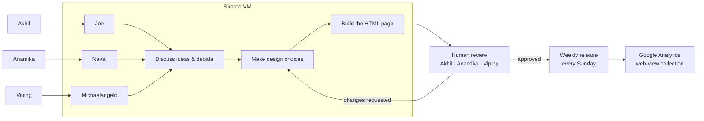

# AI Harness Landscape

> **Choose the harness, not just the model.**

A practical, maintainable map of 177 AI products and research systems across coding, autonomous engineering, self-improving systems, 3D, games, filmmaking, business intelligence, maps, healthcare, legal work, creative production, music, and agent infrastructure — with the trade-offs that headline pricing hides.

Built as a **plain-HTML static site**: no server, no build step, no dependencies. Every page is a plain `.html` file that works by double-clicking and can be hosted anywhere static files are served.

---

## The thought experiment

"Harness" is used broadly here: an operating layer that gives a model tools, context, controls, memory, or a professional workflow. That includes autonomous agents, but also 3D co-pilots, game-world systems, BI analysts, geospatial tools, clinical decision support, and legal workbenches. The key distinction is **what the system may do without human review**.

The site is a living thought experiment in two senses:

1. **The subject.** It catalogs which software systems are genuinely becoming *harnesses* — the durable value moving from models into context, tool access, identity, memory, approvals, evals, and recovery.
2. **The method.** This project itself is built the way the landscape predicts: three independent AI agents debate and design a product, and three humans review and release it. The artifact demonstrates its own thesis.

---

## The joint project

A collaborative research-and-publishing project by:

- **Akhil Gupta** — [github.com/akhil9tiet](https://github.com/akhil9tiet)
- **Anamika Dashore** — [github.com/ana0404](https://github.com/ana0404)
- **Viping Gupta** — [github.com/vipingCode](https://github.com/vipingCode)

The three of us created three agents — **Joe**, **Naval**, and **Michaelangelo** — that collaborate on a shared VM to discuss ideas, debate, make design choices, and then produce the HTML page. The three of us then sit down together and review the result closely, discuss it, and release it. This loop runs on a **weekly cadence**: a new version ships **every Sunday**.

More papers will follow soon.



---

## What's inside

```
├── index.html          The market-map page (hero, signals, picks, matrix, method)
├── articles.html       Writing index — tiles/lists sorted by date and popularity
├── css/                Shared styles (styles.css)
├── js/
│   ├── data.js         All 177 products + 18 category definitions
│   ├── catalog.js      Search / filter / sort rendering for the matrix
│   ├── articles.js     Article feed entries (schema documented in Contributing)
│   ├── articles-app.js Tiles/list rendering and sorting for the writing index
│   └── site.js         Shared navigation, injected on every page
└── templates/
    └── article.html    Blank article template (title, added/updated dates, body)
```

---

## Run locally

```bash
# Python (simplest)
python -m http.server 8000
# then open http://localhost:8000

# or Node
npx serve .
```

No install required beyond a runtime — the page also opens by double-clicking `index.html`.

---

## Site analytics

This site uses **Google Analytics to collect web views** (page views, referrers, and standard aggregate usage metrics) in accordance with the standard Google Analytics privacy and retention policy. No personally identifying information is intended to be collected; analytics are used solely to understand how the landscape page and articles are read. If you self-host a fork, analytics is entirely opt-in — drop the tracking snippet and nothing is sent.

---

## Contributing

We welcome **additions, subtractions, and edits** to the landscape. Because the map is data-driven, most contributions are one-line data changes plus cited sources. All contributions follow a standard pull-request workflow and are reviewed before the Sunday release.

### Standard PR creation policy

1. **Open an issue first** (or a discussion) describing the proposed change — *add*, *subtract*, or *edit*.
2. **Fork** this repository and create a feature branch from `main`:
   ```bash
   git checkout -b add/tool-name   # or edit/tool-name, remove/tool-name
   ```
3. Make the change following the sections below.
4. **Verify** the change loads and the data is valid (see Checklist).
5. **Open a pull request** against `main`, link it to the issue, and fill in the PR template.
6. A maintainer reviews and either merges or requests changes. Changes merge ahead of the next Sunday release.

### Additions

Products appear in two places:

- **`js/data.js`** — the single source of truth for the comparison matrix. Add one row to the `P` array in the matching category block (or propose a new category in the issue).
- **Static sections in `index.html`** — for "Fast shortlist by job", signals, and the future/picks prose. Only propose these for genuinely notable items.

Row format (`P` entries are arrays, indexed as follows):

| Index | Field         | Example                                  |
| ----- | ------------- | ---------------------------------------- |
| 0     | `cat`         | `'ide'`                                  |
| 1     | `name`        | `'Cursor'`                               |
| 2     | `maker`       | `'Anysphere'`                            |
| 3     | `desc`        | one sentence on what it is               |
| 4     | `strength`    | core strength                            |
| 5     | `trade`       | core trade-off / limitation              |
| 6     | `price`       | human-readable starting economics        |
| 7     | `fit`         | best-fit audience                        |
| 8     | `start`       | numeric entry price (for sorting)        |
| 9     | `status`      | `managed` · `open` · `caution` · `experimental` · `assistive` |

```js
['ide', 'Example', 'Maker', 'One-sentence description.', 'Core strength.', 'Trade-off.', 'Free; Pro $20/mo', 'Best-fit audience', 20, 'managed']
```

**Required for additions:** at least one citable source (vendor site, official pricing docs, project repository) plus the entry price. If a price is unverified, use `'re-check'` in the text and `caution` status.

### Edits

Change is the common case — pricing moves, trade-offs change. Submit edits as minimal diffs to the affected row(s) in `js/data.js`, and update the prose in `index.html` only when the change affects a pick/signal.

**Required for edits:** describe *before → after* in the PR and cite the new source. Entries with the `re-check` tag are explicitly open for correction.

### Subtractions

Products leave the map when they are discontinued, merged, or no longer a harness.

**Required for subtractions:** state the reason and link the source. If a product is renamed or absorbed, prefer an *edit* (name/maker/status) over a deletion so historical research remains traceable.

### Checklist

Before opening a PR, confirm:

- [ ] `node --check js/data.js` passes (and the same for any edited JS file).
- [ ] The row matches the documented field order above.
- [ ] Category key used (if applicable) exists in the `C` map in `js/data.js`.
- [ ] Price text matches the numeric `start` value.
- [ ] Sources cited; unverified data marked `re-check`.
- [ ] `python -m http.server 8000` loads the page and the product appears in the matrix.
- [ ] Snapshot date stays current with the data (see `<div class="snapshot">` in `index.html`).

### Release cadence

Reviews and merges happen **weekly, before the Sunday release**. PRs opened after the freeze wait for the following week. Research updates ("more papers to follow") arrive on the same cadence.

---

## License

The AI Harness Landscape project and all site content/documentation are released under the **MIT License**.

```
MIT License

Copyright (c) 2026 Akhil Gupta, Anamika Dashore, Viping Gupta

Permission is hereby granted, free of charge, to any person obtaining a copy
of this software and associated documentation files (the "Software"), to deal
in the Software without restriction, including without limitation the rights
to use, copy, modify, merge, publish, distribute, sublicense, and/or sell
copies of the Software, and to permit persons to whom the Software is
furnished to do so, subject to the following conditions:

The above copyright notice and this permission notice shall be included in all
copies or substantial portions of the Software.

THE SOFTWARE IS PROVIDED "AS IS", WITHOUT WARRANTY OF ANY KIND, EXPRESS OR
IMPLIED, INCLUDING BUT NOT LIMITED TO THE WARRANTIES OF MERCHANTABILITY,
FITNESS FOR A PARTICULAR PURPOSE AND NONINFRINGEMENT. IN NO EVENT SHALL THE
AUTHORS OR COPYRIGHT HOLDERS BE LIABLE FOR ANY CLAIM, DAMAGES OR OTHER
LIABILITY, WHETHER IN AN ACTION OF CONTRACT, TORT OR OTHERWISE, ARISING FROM,
OUT OF OR IN CONNECTION WITH THE SOFTWARE OR THE USE OR OTHER DEALINGS IN THE
SOFTWARE.
```